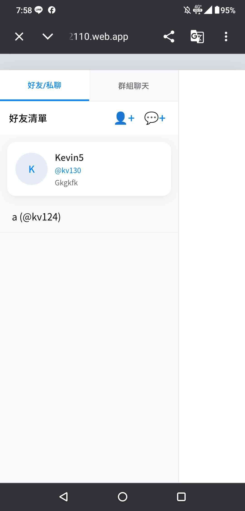
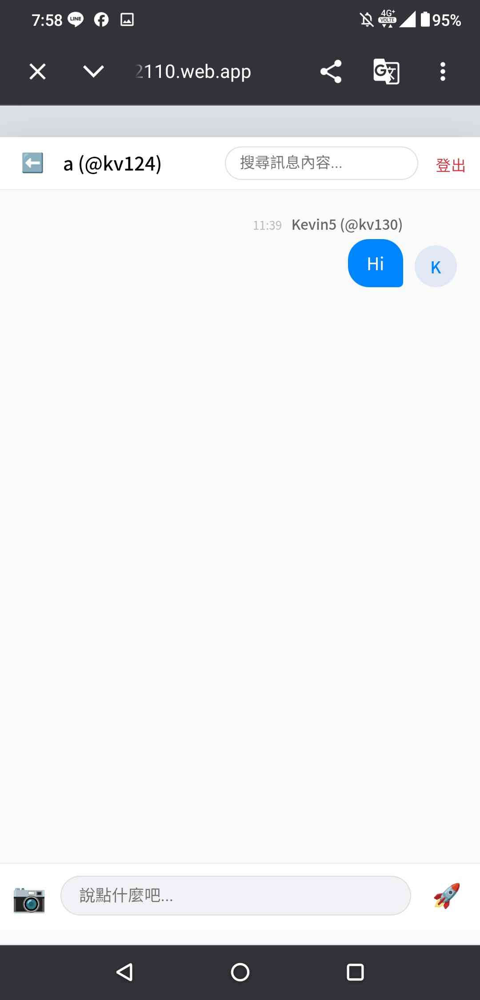

# Software Studio 2026 Spring Midterm Project - Chatroom
### 學號：113062110

## 專頁連結 (Web Page Link)
(https://midterm-113062110.web.app)

## Scoring Checksheet

### Basic Components (50%)
| **Basic Components**      | **Score** | **Check** |
| :-------------------      | :-------: | :-------: |
| Membership Mechanism (Sign Up/In)       | 5%  | Y |
| Firebase Hosting                        | 5%  | Y |
| Database read/write (Authenticated)     | 5%  | Y |
| RWD (Responsive Web Design)             | 5%  | Y |
| Git (Version Control & Regular Commits) | 5%  | Y |
| Chatroom Logic (Private/History/Invite) | 25% | Y |

### Advanced Components (35%)
| **Advanced Components** | **Score** | **Check** |
| :----------------------- | :-------: | :-------: |
| Framework (React or others) | 5% | Y |
| 3rd-party Sign In (Google) | 1% | Y |
| Chrome Notification | 5% | Y |
| CSS Animation | 2% | Y |
| XSS Prevention (Dealing with code) | 2% | Y |
| User Profile (Pic/Name/Email/Phone/Address) | 10% | Y |
| Message Operations (Edit/Search/Unsend/Image) | 10% | Y |

### Bonus Components (Max 10%)
| **Bonus Components** | **Score** | **Check** |
| :------------------- | :-------: | :-------: |
| Chatbot (ChatGPT/Gemini API) | 2% | N |
| Block User | 2% | Y |
| Send GIF from Tenor API | 3% | N |
| Message Emoji | 3% | Y |
| Reply for specify message | 6% | Y |
| Custom sticker into chatroom (Drawing) | 10% | N |

---

### 1. 登入與註冊
*   **Email 註冊**：在登入頁面點選「註冊」，輸入 Email 與密碼。
*   **Google 登入**：點選「使用 Google 帳號登入」按鈕進行google登入。
*   **初始化資料**：首次登入要設定個人暱稱與唯一的 ID。

### 2. 個人資料管理
*   點選側邊欄左方的個人卡片，即可開啟「編輯個人資料」彈窗。
*   可在此上傳頭像圖片、修改暱稱、更新電話與地址。

### 3. 聊天功能
*   **添加好友**：點選側邊欄「👤+」符號，輸入對方的 ID 即可開啟私聊。
*   **建立群組**：點選「💬+」符號，可以創建群組與取名，同時邀請成員。
*   **訊息操作**：
    *   **搜尋**：在頂部搜尋框輸入文字，可即時過濾並跳轉到對應訊息。
    *   **編輯/收回/刪除**：鼠標懸停於訊息上，點選對應按鈕進行操作。
    *   **回覆表情**：可針對特定訊息添加 Emoji 反應。
    *   **回覆訊息**：可針對特定訊息進行回覆，並且可以追蹤回覆的訊息。

### 4. 封鎖與安全
*   點選對方的頭像可查看其詳細資料。
*   在此彈窗中點選「封鎖」，對方將無法再傳送私訊，且群組內相關訊息也會不見。

---

## 進階部分 (Advanced components)
*   **Deal with problems while sending code(2%)**
*   **CSS動畫 (2%)**：訊息有一個進場動畫，讓畫面看起來比較靈活
*   **Chrome 通知 (5%)**：用chrome使用網站時，有別人傳訊息會跳通知
*   **傳送時間**:能看到每條訊息的傳送時間

---

## 手機使用畫面 (Advanced components)
*   因為螢幕較小，所以把選擇聊天室與聊天室隔開

---

## github與firebase
*   使用github做版本控制，使用firebase做專案建立

---

